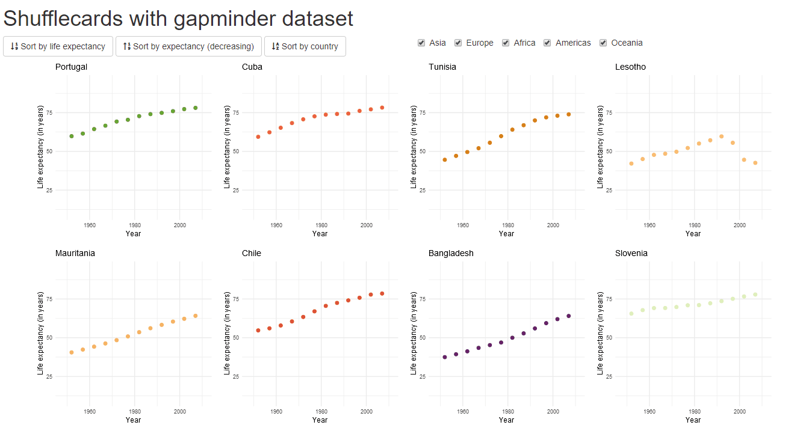

# shufflecards 

> Filter and sort grid layouts in Shiny application and Markdown document with [Shuffle.js](https://github.com/Vestride/Shuffle).


[](https://travis-ci.org/dreamRs/shufflecards)
[](https://www.repostatus.org/#wip)


## Installation

You can install `shufflecards` from GitHub:

```r
# with remotes
remotes::install_github("dreamRs/shufflecards")

# or with install-github.me service (based on remotes)
source("https://install-github.me/dreamRs/shufflecards")

# or with devtools:
devtools::install_github("dreamRs/shufflecards")
```


## Usage

**Markdown:** use `shuffle_widget` to create a grid of elements, arrange the grid with buttons and filter with `crosstalk` inputs.

**Shiny:** use `shuffle_container` to create a grid of elements in UI, use classic Shiny inputs and server-side logic to arrange & filter the grid.


## Examples


### Markdown

Only with arrange:

* With `htmlwidget` [`billboarder`](https://github.com/dreamRs/billboarder) : https://dreamrs.github.io/tweets-transports/
* With HTML tags : https://dreamrs.github.io/shufflecards/playing-cards
* With [`flexdashboard`](https://rmarkdown.rstudio.com/flexdashboard/index.html) and [`highcharter`](http://jkunst.com/highcharter/index.html) : https://dreamrs.github.io/shufflecards/flexdashboard
* With [`ggplot2`](https://ggplot2.tidyverse.org/) : https://dreamrs.github.io/shufflecards/gapminder-md-ggplot2


### Shiny

You can run the playing cards example with:
```r
shufflecards::play()
```

With data from `gapminder` package and `ggplot2`:




## Related package

* [trelliscopejs R Package](https://github.com/hafen/trelliscopejs) : Trelliscope is a scalable, flexible, interactive approach to visualizing data.

